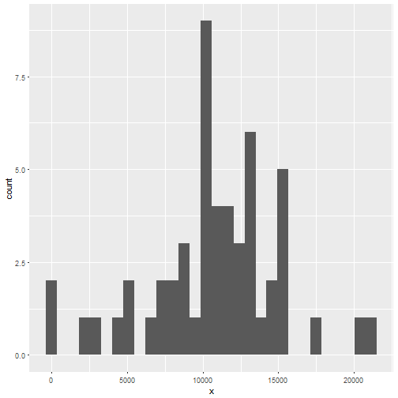
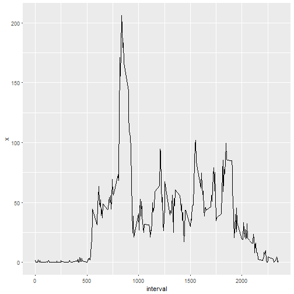
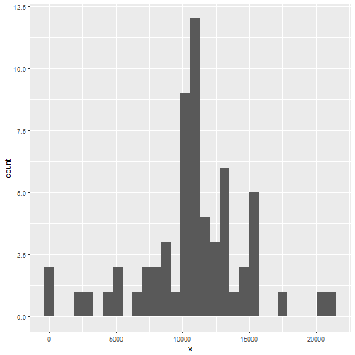
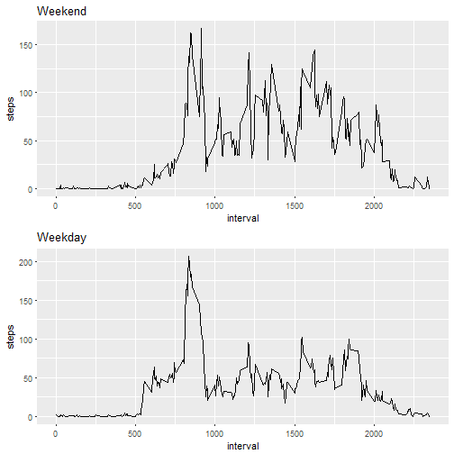

--- 
title: "Reproducible Research - Course Project 1" 
output: 
  html_document: 
    keep_md: true 
---
### Loading and Preprocessing the Data


```r
activitydata <- read.csv("activity.csv")
colnames(activitydata) <- c("steps","date","interval")
subset_activitydata <- activitydata[which(activitydata$steps != "NA"), names(activitydata) %in%
                                            c("steps","date","interval")]
head(subset_activitydata)
```

```
##     steps       date interval
## 289     0 2012-10-02        0
## 290     0 2012-10-02        5
## 291     0 2012-10-02       10
## 292     0 2012-10-02       15
## 293     0 2012-10-02       20
## 294     0 2012-10-02       25
```


### What is mean total number of steps taken per day?


```r
library(ggplot2)
steps_by_day <- aggregate(subset_activitydata$steps, by=subset_activitydata["date"], FUN=sum)
head(steps_by_day)
```

```
##         date     x
## 1 2012-10-02   126
## 2 2012-10-03 11352
## 3 2012-10-04 12116
## 4 2012-10-05 13294
## 5 2012-10-06 15420
## 6 2012-10-07 11015
```

```r
ggplot(steps_by_day, aes(x=x)) + geom_histogram()
```

```
## `stat_bin()` using `bins = 30`. Pick better value with `binwidth`.
```



```r
mean(steps_by_day$x)
```

```
## [1] 10766.19
```

```r
median(steps_by_day$x)
```

```
## [1] 10765
```

### What is the average daily activity pattern?

```r
library(ggplot2)
average_steps_per_interval <- aggregate(subset_activitydata$steps, by=subset_activitydata["interval"], FUN=mean)
head(average_steps_per_interval)
```

```
##   interval         x
## 1        0 1.7169811
## 2        5 0.3396226
## 3       10 0.1320755
## 4       15 0.1509434
## 5       20 0.0754717
## 6       25 2.0943396
```

```r
ggplot(average_steps_per_interval,
              aes(x = interval, y = x)) + geom_line()
```



```r
average_steps_per_interval[which.max(average_steps_per_interval$x),]
```

```
##     interval        x
## 104      835 206.1698
```

### Inputing Missing Values
### Rows with NA

```r
count_all_rows <- nrow(activitydata)
count_filled_rows <- nrow(subset_activitydata)
return(count_all_rows-count_filled_rows)
```

```
## [1] 2304
```

### Fill NAs with Average Value for Interval

```r
merge1 <- merge(activitydata, average_steps_per_interval, by="interval")
for (i in 1:nrow(merge1)){
        if (is.na(merge1[i,2])){ 
                merge1[i,2] <- merge1[i,4]
        }
        else {
                merge1[i,2] <- merge1[i,2]
                }
}
head(merge1)
```

```
##   interval    steps       date        x
## 1        0 1.716981 2012-10-01 1.716981
## 2        0 0.000000 2012-11-23 1.716981
## 3        0 0.000000 2012-10-28 1.716981
## 4        0 0.000000 2012-11-06 1.716981
## 5        0 0.000000 2012-11-24 1.716981
## 6        0 0.000000 2012-11-15 1.716981
```

```r
steps_by_day_2 <- aggregate(merge1$steps, by=merge1["date"], FUN=sum)
head(steps_by_day_2)
```

```
##         date        x
## 1 2012-10-01 10766.19
## 2 2012-10-02   126.00
## 3 2012-10-03 11352.00
## 4 2012-10-04 12116.00
## 5 2012-10-05 13294.00
## 6 2012-10-06 15420.00
```

```r
ggplot(steps_by_day_2, aes(x=x)) + geom_histogram()
```

```
## `stat_bin()` using `bins = 30`. Pick better value with `binwidth`.
```



```r
mean(steps_by_day_2$x)
```

```
## [1] 10766.19
```

```r
median(steps_by_day_2$x)
```

```
## [1] 10766.19
```
##### Yes, the values differ from the estimates from the first part of the assignment. The impact is that now the median number of steps and mean number of steps are the same.

### Are there differences in activity patterns between weekdays and weekends?

```r
for (i in 1:nrow(merge1)){
        merge1[i,5] <- weekdays(as.Date(merge1[i,3]), abbreviate = FALSE)}
steps_by_day_3 <- aggregate(merge1$steps, by=merge1["V5"], FUN=mean)
print(steps_by_day_3)
```

```
##          V5        x
## 1    Friday 41.68610
## 2    Monday 35.24552
## 3  Saturday 42.75789
## 4    Sunday 41.97491
## 5  Thursday 29.50162
## 6   Tuesday 31.07485
## 7 Wednesday 40.54483
```

```r
merge2 <- merge(merge1, steps_by_day_3, by="V5")
subset_merge2_weekend <- merge2[which((merge2$V5 == "Saturday") | (merge2$V5 == "Sunday")), names(merge2) %in%
                                            c("V5","interval","steps","date","x.x","x.y")]
subset_merge2_weekday <- merge2[which((merge2$V5 != "Saturday") | (merge2$V5 != "Sunday")), names(merge2) %in%
                                            c("V5","interval","steps","date","x.x","x.y")]

steps_by_interval <- aggregate(subset_merge2_weekend$steps, by=subset_merge2_weekend["interval"], FUN=mean)
colnames(steps_by_interval) <- c("interval","steps")

steps_by_interval2 <- aggregate(subset_merge2_weekday$steps, by=subset_merge2_weekday["interval"], FUN=mean)
colnames(steps_by_interval2) <- c("interval","steps")

plot1 <- ggplot(steps_by_interval,
              aes(x = interval, y = steps)) + geom_line() + ggtitle("Weekend")

plot2 <- ggplot(steps_by_interval2,
              aes(x = interval, y = steps)) + geom_line() + ggtitle("Weekday")

library(gtable)
plot1 <- ggplotGrob(plot1)
plot2 <- ggplotGrob(plot2)
g <- rbind(plot1, plot2, size = "first")
grid::grid.draw(g)
```


